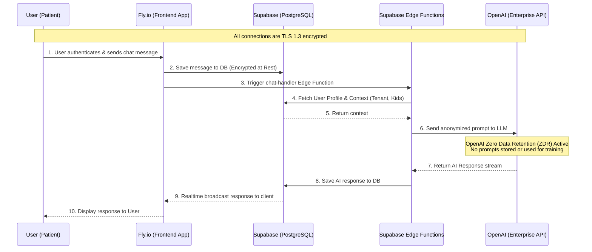

# Whisperoo Data Flow Map
**HIPAA Stage 2 Compliance Documentation**
**Last Updated:** May 1, 2026

The following map illustrates the flow of Protected Health Information (PHI) through the Whisperoo system architecture.

### Key Technical Safeguards
1. **Encryption in Transit:** All traffic between the User, Fly.io, Supabase, and OpenAI is encrypted via TLS 1.2+.
2. **Encryption at Rest:** Supabase PostgreSQL database volumes are encrypted at rest using AES-256.
3. **Data Segregation:** Row Level Security (RLS) policies in Supabase ensure users can only access their own profile and chat data. Super Admins access is tightly controlled via `tenant_id` scoping.
4. **Third-Party Processing:** OpenAI is restricted to processing prompts purely in-memory. Zero Data Retention ensures no PHI is persisted on their servers.
